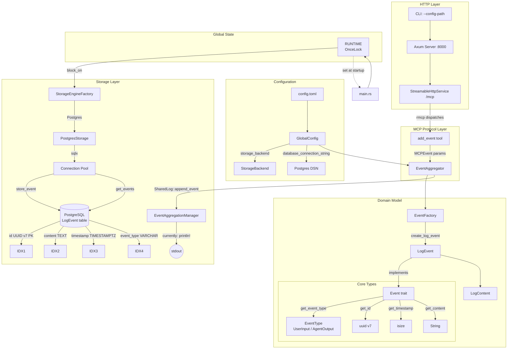
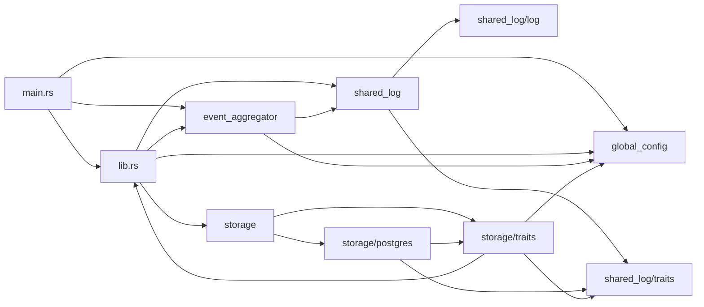
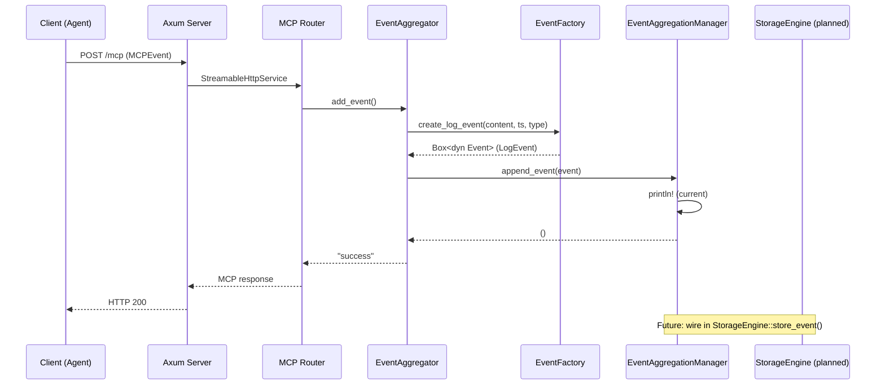

# LogAct Architecture

```mermaid
flowchart TD
    subgraph HTTP["HTTP Layer"]
        CLI[CLI: --config-path] --> AXUM[Axum Server :8000]
        AXUM --> MCP[StreamableHttpService /mcp]
    end

    subgraph CONFIG["Configuration"]
        CFG[config.toml] --> GC[GlobalConfig]
        GC --> |storage_backend| BACKEND[StorageBackend]
        GC --> |database_connection_string| DSN[Postgres DSN]
    end

    subgraph MCP_LAYER["MCP Protocol Layer"]
        MCP --> |rmcp dispatches| ADD[add_event tool]
        ADD --> |MCPEvent params| FMT[EventAggregator]
    end

    subgraph DOMAIN["Domain Model"]
        FMT --> EF[EventFactory]
        EF --> |create_log_event| LE[LogEvent]
        LE --> |implements| ET[Event trait]
        LE --> LC[LogContent]

        subgraph TYPES["Core Types"]
            ET --> |get_event_type| EVT[EventType<br/>UserInput / AgentOutput]
            ET --> |get_id| UUID[uuid v7]
            ET --> |get_timestamp| TS[isize]
            ET --> |get_content| CONT[String]
        end
    end

    subgraph STORAGE["Storage Layer"]
        FMT --> |SharedLog::append_event| MGR[EventAggregationManager]
        MGR --> |currently: println!| STDOUT((stdout))

        SEF[StorageEngineFactory] --> |Postgres| PG[PostgresStorage]
        PG --> |sqlx| POOL[Connection Pool]
        POOL --> |store_event| DB[(PostgreSQL<br/>LogEvent table)]
        POOL --> |get_events| DB
        DB --> |id UUID v7 PK| IDX1
        DB --> |content TEXT| IDX2
        DB --> |timestamp TIMESTAMPTZ| IDX3
        DB --> |event_type VARCHAR| IDX4
    end

    subgraph GLOBAL["Global State"]
        RT[RUNTIME<br/>OnceLock<Runtime>] --> |block_on| SEF
    end

    GC --> FMT
    RT -.-> |set at startup| MAIN[main.rs]
    MAIN --> RT
```

## Module Dependency Graph

```mermaid
flowchart LR
    MAIN[main.rs] --> LIB[lib.rs]
    MAIN --> GC[global_config]
    MAIN --> EA[event_aggregator]

    LIB --> EA
    LIB --> GC
    LIB --> SL[shared_log]
    LIB --> ST[storage]

    EA --> GC
    EA --> SL

    SL --> LOG[shared_log/log]
    SL --> TR[shared_log/traits]

    ST --> PG[storage/postgres]
    ST --> STR[storage/traits]

    PG --> TR
    PG --> STR
    STR --> TR
    STR --> LIB
    STR --> GC
```

## Data Flow

```mermaid
sequenceDiagram
    participant C as Client (Agent)
    participant A as Axum Server
    participant M as MCP Router
    participant E as EventAggregator
    participant F as EventFactory
    participant L as EventAggregationManager
    participant S as StorageEngine (planned)

    C->>A: POST /mcp (MCPEvent)
    A->>M: StreamableHttpService
    M->>E: add_event()
    E->>F: create_log_event(content, ts, type)
    F-->>E: Box<dyn Event> (LogEvent)
    E->>L: append_event(event)
    L->>L: println! (current)
    L-->>E: ()
    E-->>M: "success"
    M-->>A: MCP response
    A-->>C: HTTP 200

    Note over L,S: Future: wire in StorageEngine::store_event()
```
